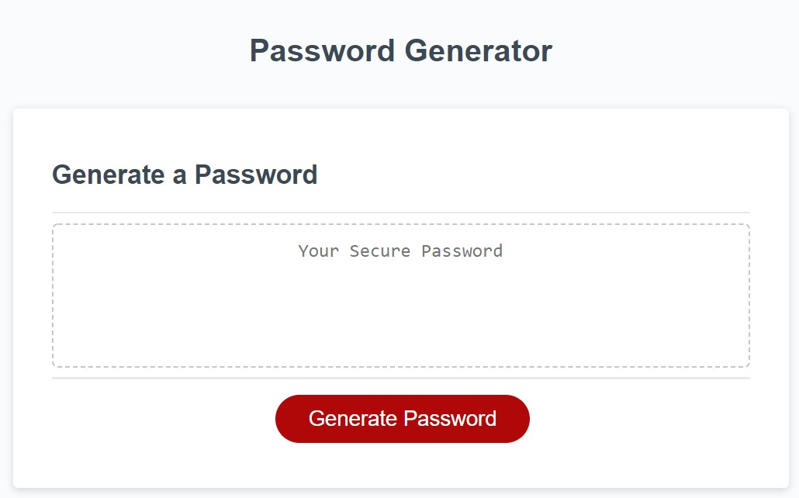
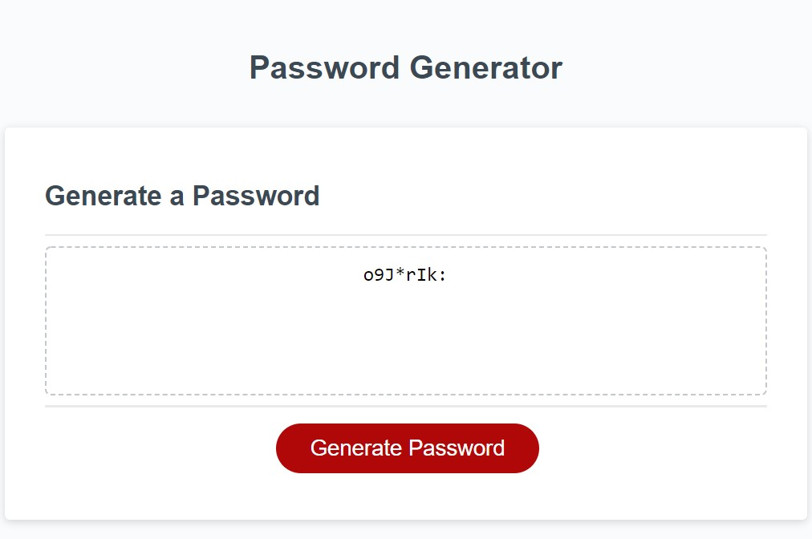

# JS_Password_Generator
DJM Bootcamp Homework WK3: JS Project - Password Generator

## Notes
This website was built using some provided code for the project.  Most of the coding was focused on Javascript functionality.

The initial state of the site begins with a simple restults box with a generate password button below.

When the generate password button is clicked, a series of prompts are generated which request the user enter in password length from 8 - 128 characters, then select the characters to include in the password (lower case, upper case, numbers, and symbols).  If the user enters in an invalid number or does not select any character types, the propts will run again.  Each of the selected character types are concatinated into a string for the possible password contents. The password is then randomly generated using .charAt and Math.floor(Math.random) methods on the contents string to populate a string containing the generated password.  

Once the prompts have been entered correctly, a password is generated and displayed using the above methods.  The password is also checked using regular expressions versus the desired character contents (as input by user) and an Alert will display notifing the user, who then is prompted to re-enter their desired parameters (length, contents).

## Deployed Site

[Deployed](https://danielmrva.github.io/JS_Password_Generator/)

## Github

[Github](https://github.com/DanielMrva/JS_Password_Generator)

